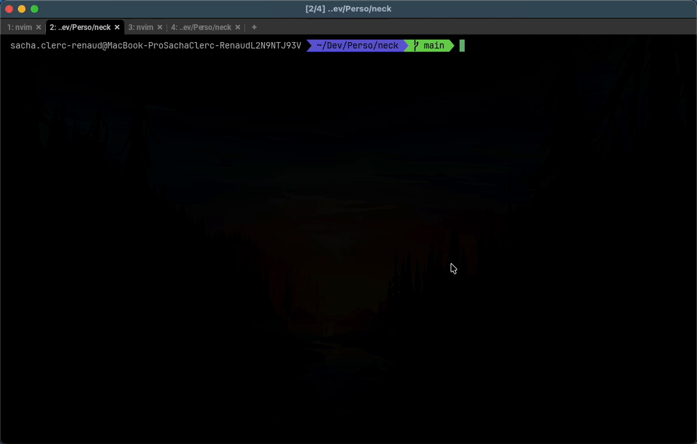

# Terminal Fret Board 

A CLI tool that display guitar chords and scales in the terminal. It is built to supports any kind of instrument that has strings with frets.

It's one more reason to stay in your terminal. 

# TFB command 

By default the `tfb` command is interactive, allowing you to search for a given mode and root note.

- use `up` and `down` to browse the list.
- use `left` and `right` to change root note.
- use `/` to fuzzy search a mode name.
- use `esc` to reset the UI.

Tips: `hjkl` are supported too.



But you can also pass argument like this 

`tfb ionian -r D` : This will directly render the diagram to the standard output.

# Chords

```bash
$ tfb chord 0-2-2-0-0-0 
```
Will display:

```bash
E 0╓────┬────┬────┬─
B 0╟────┼────┼────┼─
G 0╟────┼────┼────┼─
D  ╟────┼─⬤─┼────┼─
A  ╟────┼─⬤─┼────┼─
E 0╙────┴────┴────┴─
```

Print chords that you pass in argument. Example: `0-2-2-0-0-0`

Use `x` to mute strings. Example `x-x-0-2-3-2`

```bash
E  ╓────┬─⬤─┬────┬─
B  ╟────┼────┼─🔴─┼─
G  ╟────┼─⬤─┼────┼─
D 0╟────┼────┼────┼─
A x╟────┼────┼────┼─
E x╙────┴────┴────┴─
```

Usage:
  tfb chord [flags]

Flags:

  `-h`, `--help`          help for chord

  `-n`, `--name` string   Give a chord name like Major7 or m7b5

  `-r`, `--root` string   Set the root of your chord. Example: C, D#, Bb...

# Scales 

```bash
$ ./tfb scale C-D-E-F-G-A-B
```

Will display:
```bash
E  ╓─⬤─┬────┬─⬤─┬────┬─⬤─┬────┬─⬤─┬─🔴─┬────┬─⬤─┬────┬─⬤─┬─
B  ╟─🔴─┼────┼─⬤─┼────┼─⬤─┼─⬤─┼────┼─⬤─┼────┼─⬤─┼────┼─⬤─┼─
G  ╟────┼─⬤─┼────┼─⬤─┼─🔴─┼────┼─⬤─┼────┼─⬤─┼─⬤─┼────┼─⬤─┼─
D  ╟────┼─⬤─┼─⬤─┼────┼─⬤─┼────┼─⬤─┼────┼─⬤─┼─🔴─┼────┼─⬤─┼─
A  ╟────┼─⬤─┼─🔴─┼────┼─⬤─┼────┼─⬤─┼─⬤─┼────┼─⬤─┼────┼─⬤─┼─
E  ╙─⬤─┴────┴─⬤─┴────┴─⬤─┴────┴─⬤─┴─🔴─┴────┴─⬤─┴────┴─⬤─┴─
               •         •         •         •              ••
```

Print scale that you pass in argument. Example: `C-D-E-F-G-A-B`

Takes the first note of the scale as root note.

Usage:
  tfb scale [flags]

Flags:

- `-h`, `--help`          help for scale

- `-n`, `--name` string   Set the scale name. Example: Major

- `-f`, `--from` int      Render from that fret number (default 1)

- `-t`, `--to` int        Last fret number to render (default 12)

- `m`, `--mode` string    Select the display mode either `circle` or `note`. Default to circle

- `i`, `--inst` string    Set the instrument type, `G` for guitar, `B` for Bass, `U` for Ukulele (default `G`)

# TODO

- [x] Rename fretString into neckString and move it under the neck package
- [ ] Add a pkg directory at the root of the repository. Verify what is internal or not.
- [ ] `s`, `--style` options to choose the renderng style: utf8, ascii, etc...
- [x] An options to display note names instead of circles. Maybe `--mode`, `m` 
- [x] Verify everything works with `#` and `b` note with  
- [ ] Add a `quiz` subcommand that randomly display a fret on the screen and wait for you to type the note's name.
- [x] Make the base command `tfb` displaying the fretboard with all the notes.
- [x] `-i`, `--instrument` option to choose between Guitar, Bass, Ukulele
- [ ] `-t`, `--tuning` option to choose the tuning
- [ ] Add tests
- [x] Make tfb root command interactive. Allow to select a mode and a root and then render the neck
- [ ] Refactor root command to separate concerns

